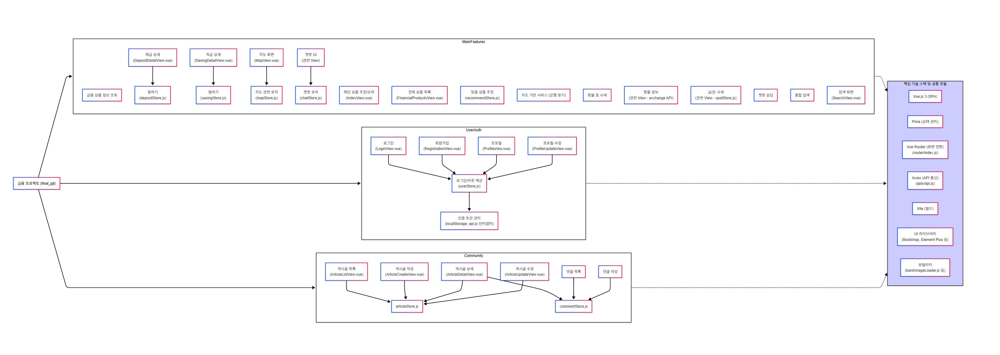
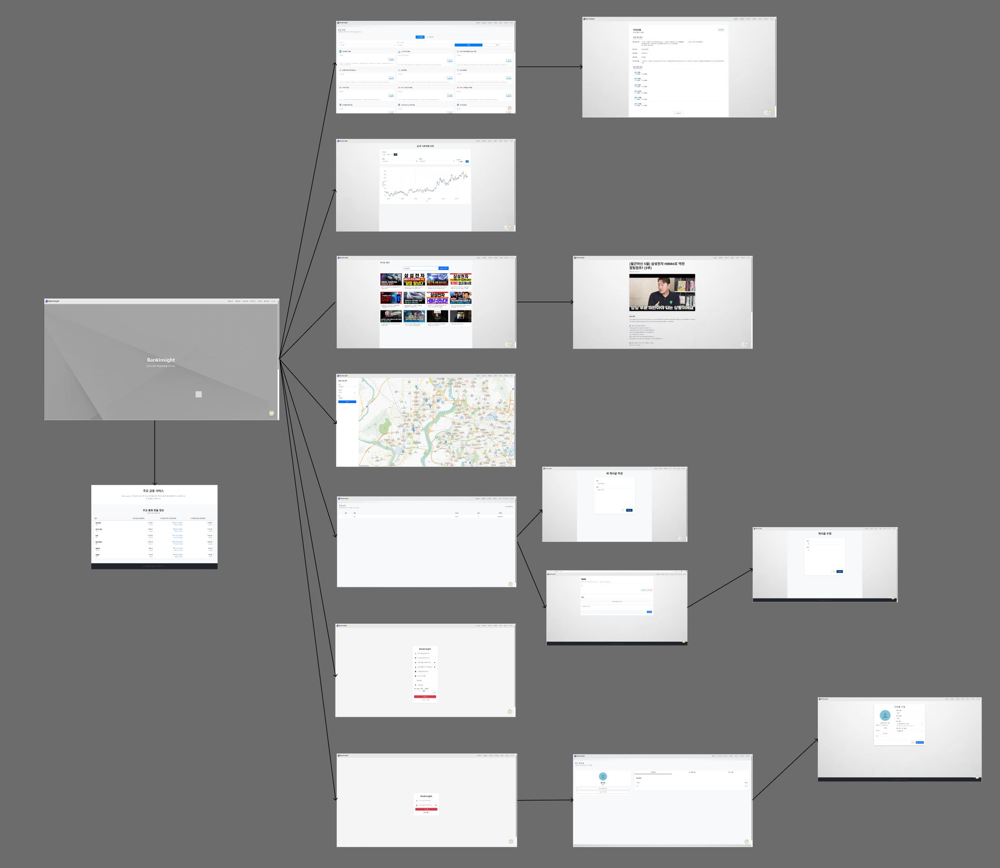

# BankInsight 🏦
**개인 맞춤형 금융 상품 추천 및 정보 공유 플랫폼 BankInsight에 오신 것을 환영합니다.**
BankInsight는 사용자의 금융 프로필과 현재 자산 및 나이 등을 종합적으로 분석하여 최적의 금융 상품을 추천하고, 사용자간 금융 정보를 나눌 수 있는 커뮤니티를 제공합니다.

## 🛠 핵심 기술 스택

### 💻 Front-end
-   **Vue.js**: UI 구축 및 SPA 개발
-   **Pinia**: 상태 관리
-   **Vue Router**: 페이지 내비게이션
-   **Axios**: API 통신
-   **Vite**: 빌드 시스템

### ⚙️ Back-end
-   **Python** & **Django**: 웹 프레임워크 및 API 개발
-   **Django REST framework**: RESTful API 구축
-   **dj-rest-auth**: 사용자 인증
-   **Google Gemini API**: AI 대화형 금융 챗봇 연동

## 설계 및 구조

#### 서비스 아키텍처

#### UI/UX 디자인 목업

## DATABASE
#### ERD (Entity Relationship Diagram)

## ⭐ 주요 기능 소개

BankInsight는 사용자 여러분의 현명한 금융 생활을 돕기 위해 다음과 같은 핵심 기능들을 제공합니다.

-   **맞춤형 금융 상품 추천**: 사용자의 금융 정보 및 유사 사용자(연령별/자산별) 기반 상품 추천 (관련 모듈: `recommendStore.js`)
-   **금융 상품 탐색 및 비교**: 금융감독원 금융상품한눈에 API를 활용한 예/적금 및 **주택담보/전세자금 대출** 상품 정보, 기간별 금리 비교(차트 제공), 은행별 검색 기능 (`FinancialProductsView.vue`, `DepositDetailView.vue`, `SavingDetailView.vue`, 대출 모듈, `depositStore.js`, `savingStore.js`)
-   **위치 기반 영업점 찾기**: 카카오맵 API 연동, 지명 및 지역구 기반 주변 은행 영업점 자동 검색 (`MapView.vue`, `mapStore.js`)
-   **실시간 환율 변환기**: 주요 통화 환율 정보 안내 및 비동기 계산 기능 (백엔드 `exchange` 서버 API 연동 및 `HomeCarousel.vue` 연동)
-   **금/원유 실물 시세 제공**: 실시간 금(Gold) 및 원유 시세 변동 추이 차트 조회 (`spot` 데이터 연동)
-   **금융결제원 데이터 연동 (KFTC)**: 금융결제원 FIN MAP API를 활용한 계좌 통신 및 내부 API 연결 조회
-   **커뮤니티**: 금융/재테크 노하우 공유 자유 게시판(게시글/댓글 CRUD) (`articleStore.js`, `commentStore.js`)
-   **금융 상품 및 영업점 찜하기**: 관심 상품 및 내 주변 지점 등록/삭제 및 직관적인 낙관적 시각화(Optimistic UI) 
-   **사용자 프로필**: 개인 금융 재무 정보 세팅, 찜한 상품 목록 통합 관리 뷰, 회원 탈퇴 (`ProfileView.vue`, `userStore.js`)
-   **AI 금융 비서(챗봇)**: Google Gemini API(Flash/LLM) + 자체 RAG 아키텍처 기반의 팩트 체크된 재무 상담 및 딥링크 상품 추천 (`chatStore.js`, 백엔드 `chatbot`)

## 📌 핵심 구현 목표

BankInsight는 사용자 중심의 금융 정보 접근성 향상을 목표로 다음과 같은 기능들을 충실히 구현해 내었습니다.

* **사용자 인증 및 관리**: 회원가입부터 프로필 수정, 찜 목록 관리까지 안전하고 편리한 사용자 환경을 제공합니다.
* **통합 금융 정보 제공**: 다양한 예/적금, 대출 상품 정보를 효과적으로 탐색하고, 상세 금리 비교를 통해 합리적인 선택을 지원합니다.
* **개인화 추천 시스템**: 유저 특성을 고려한 두 가지 방식의 맞춤형 상품 추천 로직을 통해 만족도를 최대한 높입니다.
* **편의 기능**: 카카오맵 기반 주변 점포 검색, 실시간 환율 계산기, 금속/에너지 국제 시세 테이블, 24시간 실시간 AI 챗봇 등 금융 생활에 유용한 부가 인프라를 총합했습니다.
* **소통 공간**: 금융 정보를 넘어서, 커뮤니티 기능을 통해 사용자와 사용자가 소통할 수 있는 인프라를 확립했습니다.
