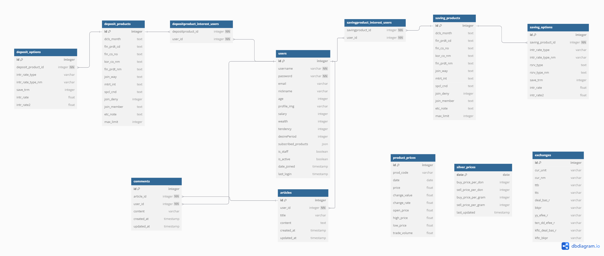

# BankInsight 🏦✨

**개인 맞춤형 금융 상품 추천 및 정보 공유 플랫폼, BankInsight에 오신 것을 환영합니다!**
BankInsight는 사용자의 금융 프로필과 앱 내 사용자 데이터를 종합적으로 분석하여 최적의 금융 상품을 추천하고, 유용한 금융 정보를 나눌 수 있는 커뮤니티를 제공합니다.
## 🚀 핵심 기술 스택

### 🖥️ Front-end
-   **Vue.js**: UI 구축 및 SPA 개발
-   **Pinia**: 상태 관리
-   **Vue Router**: 페이지 네비게이션
-   **Axios**: API 통신
-   **Vite**: 빌드 시스템

### ⚙️ Back-end
-   **Python** & **Django**: 웹 프레임워크 및 API 개발
-   **Django REST framework**: RESTful API 구축
-   **dj-rest-auth**: 사용자 인증
-   **OpenAI API Client**: AI 챗봇 연동

## 🗺️ 설계 및 구조

#### 서비스 아키텍처

#### UI/UX 디자인 목업

## DATABASE
#### ERD (Entity Relationship Diagram)

## 💡 주요 기능 소개

BankInsight는 사용자 여러분의 현명한 금융 생활을 돕기 위해 다음과 같은 핵심 기능들을 제공합니다.

-   **맞춤형 금융 상품 추천**: 사용자의 금융 정보 및 유사 사용자/연령대 기반 상품 추천 (관련 모듈: `recommendStore.js`)
-   **금융 상품 탐색 및 비교**: 예/적금 상품 정보, 기간별 금리 비교(차트 제공), 은행별 검색 기능 (`FinancialProductsView.vue`, `DepositDetailView.vue`, `SavingDetailView.vue`, `depositStore.js`, `savingStore.js`)
-   **지도 기반 은행 찾기**: 카카오맵 API 연동, 지역별 은행 검색 (`MapView.vue`, `mapStore.js`)
-   **실시간 환율 계산기**: 주요 통화 환율 정보 및 계산 기능 (백엔드 `exchange` 앱 API 연동)
-   **커뮤니티**: 금융 정보 공유 게시판 (게시글/댓글 CRUD) (`articleStore.js`, `commentStore.js`)
-   **금융 상품 찜하기**: 관심 상품 등록/해제 및 타 사용자 찜 현황 확인
-   **사용자 프로필**: 개인 금융 정보 수정, 찜한 상품 목록 관리, 회원 탈퇴 (`ProfileView.vue`, `userStore.js`)
-   **AI 금융 챗봇**: GPT-4o-mini 기반, 개인 맞춤형 금융 상담 및 상품 추천 (`chatStore.js`, 백엔드 `chatbot` 앱)

## ✨ 프로젝트 구현 범위

BankInsight는 사용자 중심의 금융 정보 접근성 향상을 목표로 다음과 같은 핵심 기능들을 충실히 구현하였습니다.

* **사용자 인증 및 관리**: 회원가입부터 프로필 수정, 찜 목록 관리까지 안전하고 편리한 사용자 환경을 제공합니다.
* **금융 상품 정보 제공**: 다양한 예/적금 상품 정보를 효과적으로 탐색하고, 상세 금리 비교를 통해 합리적인 선택을 지원합니다.
* **개인화 추천 시스템**: 사용자의 특성을 고려한 두 가지 방식의 맞춤형 상품 추천 로직을 통해 만족도를 높입니다.
* **편의 기능**: 지도 기반 은행 검색, 실시간 환율 계산기, AI 챗봇 등 금융 생활에 유용한 부가 기능들을 통합했습니다.
* **소통 공간**: 커뮤니티 기능을 통해 사용자 간 금융 지식과 경험을 공유할 수 있는 플랫폼을 마련했습니다.

모든 주요 기능들은 실제 서비스 가능한 수준으로 개발되었으며, 직관적인 UI/UX 디자인을 통해 사용 편의성을 확보했습니다.